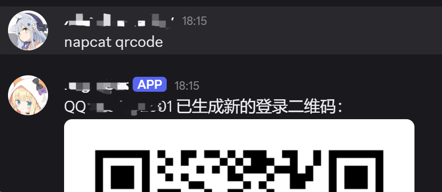

<div align="center">
  <a href="https://v2.nonebot.dev/store">
    
  </a>

## ✨ nonebot-plugin-ncqrcode ✨

[](./LICENSE)
[](https://www.python.org)

</div>

监控 NapCat 登录状态，方便在tx每日打击 Bot 掉线后自动尝试恢复，并通过另一个 Bot 向已订阅会话发送登录二维码。建议使用 Telegram 或 Discord Bot 接收通知。

## 安装

```bash
nb plugin install nonebot-plugin-ncqrcode
```

或：

```bash
uv add nonebot-plugin-ncqrcode
```

## 配置

```dotenv
# NapCat WebUI 的访问地址
NCQRCODE_BASE_URL=http://127.0.0.1:6099

# NapCat WebUI 的访问密钥
NCQRCODE_TOKEN=Napcat WebUI 密钥

# 需要监控和恢复登录的 QQ 号
NCQRCODE_ACCOUNT_ID=被监控的 QQ 号

# 每次掉线最多向订阅目标发送二维码的次数，默认为 5
NCQRCODE_MAX_QR_NOTIFICATIONS=5
```

## 使用

仅限 `SUPERUSER` 使用：

| 命令              | 说明                           |
| ----------------- | ------------------------------ |
| `/nc subscribe`   | 将当前场景设为通知目标         |
| `/nc unsubscribe` | 清除通知目标                   |
| `/nc qrcode`      | 获取登录二维码，仅回复当前会话 |

## 效果图


